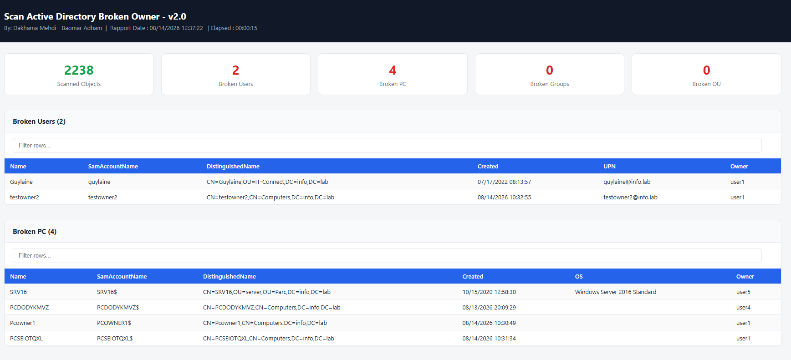

# Scan Actve Directory Vulnerable Owner

This script helps companies audit Owner vulnerabilities on Active Directory objects reference 'vuln3_owner', and prevents attacks based on object ownership abuse. It scans and lists broken owners representing a security risk, across user accounts, computers, groups, and Organizational Units.

Objective: clean up Active Directory and reduce ownership-based control-takeover (CT) vulnerabilities on objects.

## 📸 Screenshot

[Online Example] : [View Online Example](https://dakhama-mehdi.github.io/Scan-broken-owner/Picture/report-brokenowner.html)

## About

When a user creates an object in Active Directory, they automatically become its Owner and can modify its permissions at any time, even if their explicit access to the object is later removed, they can still act on it through ownership rights alone. This makes such objects a persistent target: recovering control of them can grant access to accounts and resources far beyond the original scope.

 ## Recommendation

Both Microsoft and ANSSI (French National Cybersecurity Agency) recommend setting a privileged group (Domain Admins, Enterprise Admins, or an equivalent dedicated administrative group) as the Owner of Active Directory objects.

- Microsoft: https://docs.microsoft.com/en-us/previous-versions/windows/it-pro/windows-server-2008-R2-and-2008/dd125370(v=ws.10)?redirectedfrom=MSDN
- ANSSI guide (ANSSI-PA-099): https://cyber.gouv.fr/publications/recommandations-pour-ladministration-securisee-des-si-reposant-sur-ad
- IT-Connect (FR): https://www.it-connect.fr/securite-de-lactive-directory-attention-aux-objets-avec-un-proprietaire-inadapte/

This script lists all objects that do not have the recommended, legitimate Owner property, and helps prevent attacks such as Kerberos Resource-Based Constrained Delegation abuse via Computer Object takeover.

## How to use

Run Scaboo-v2.0.ps1 from a machine joined to the AD domain, using a standard domain user account. No administrative rights, RSAT, or ActiveDirectory PowerShell module are required, it relies only on adsisearcher/ADSI, built into Windows.

To skip specific groups or users from the scan, add them to the skip list near the top of the script (`$skipdefaultgroups`). The report is generated in HTML format by default.

## Credits

Developed by Dakhama Mehdi.  
Contribution: Baomar Adham.  
Thanks to It-Connect.fr.  
